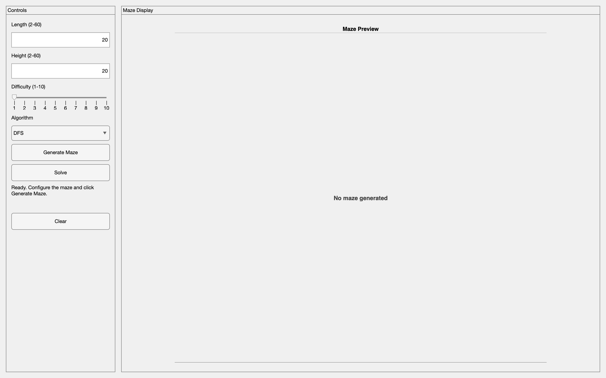
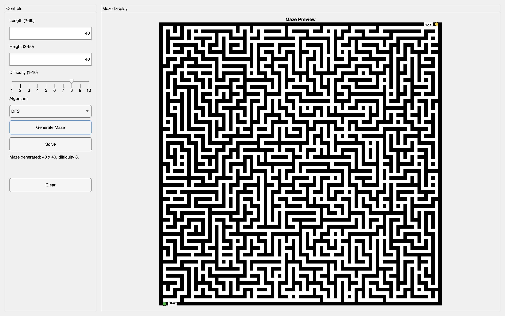
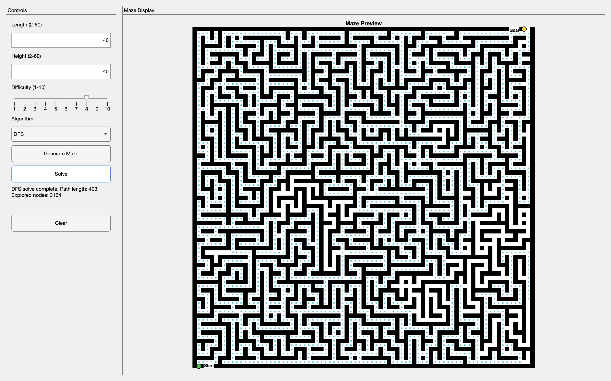
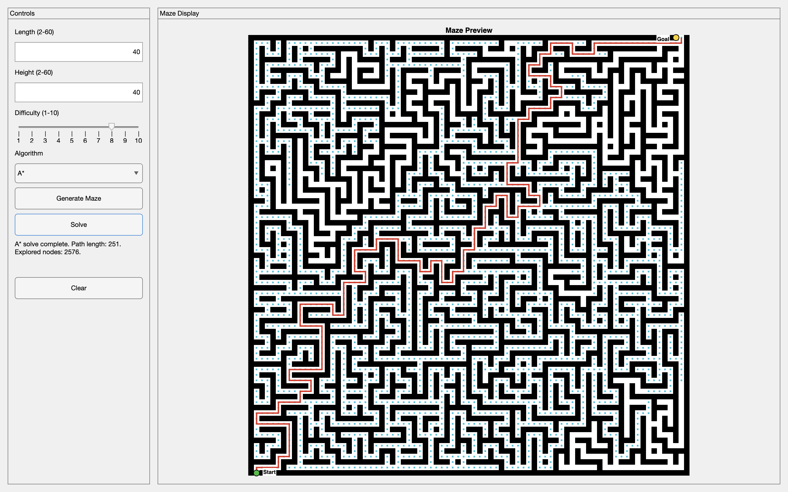

# MATLAB Maze Generator and Solver

This project was originally completed in 2023 as a course project and has been uploaded to GitHub as part of my portfolio. It is a MATLAB-based maze generator and solver with a graphical user interface that allows users to configure maze dimensions, difficulty, and solving algorithm.

## What does this project do?

This project generates and solves a maze in MATLAB through a graphical user interface. The user can choose the maze length, height, difficulty, and the algorithm used to solve the maze.

To generate the maze, the program follows these steps:

1. Generate a grid-based maze matrix containing walls and open paths.
2. Treat the logical maze cells as connected nodes.
3. Use a Depth-First Search (DFS) backtracking approach to carve passages between cells and create a valid maze.
4. Add entry and exit points so the maze can always be solved.
5. Adjust the maze difficulty by opening extra walls:
   - lower difficulty creates a more open maze with more possible routes
   - higher difficulty keeps the maze closer to a stricter maze structure with more dead ends

The program then allows the maze to be solved and visualised using different pathfinding algorithms.

## Features

- MATLAB graphical user interface
- User-defined maze length and height
- Adjustable difficulty setting
- Maze generation and visualisation
- Animated solving and path tracing
- DFS, BFS, and A* pathfinding
- Exploration visualisation for search behaviour
- Clear/reset functionality

## Algorithms used

### DFS

DFS is used to generate the maze using a backtracking approach. It can also be used as a solving algorithm, where it explores one branch deeply before backtracking.

### BFS

BFS explores the maze level by level and guarantees the shortest path in this unweighted grid-based maze.

### A*

A* uses a heuristic to guide the search toward the goal more efficiently, while still finding a shortest path in the maze.

## Maze representation

The maze is stored as a matrix where:

- `1` represents a wall
- `0` represents an open path

In the interface, walls are shown in black and traversable paths are shown in white. The start and goal positions are marked clearly, and the selected solving algorithm animates both the explored area and the final solution path.

## Screenshots

### Main interface

### Generated maze

### DFS exploration

### DFS solution

### A* solution

## How to run

1. Open MATLAB
2. Run `maze_app`
3. Enter maze length, height, and difficulty
4. Select a solving algorithm
5. Click **Generate Maze**
6. Click **Solve**

## Notes

This project was originally completed in 2023 and is being uploaded to GitHub as part of my portfolio.
